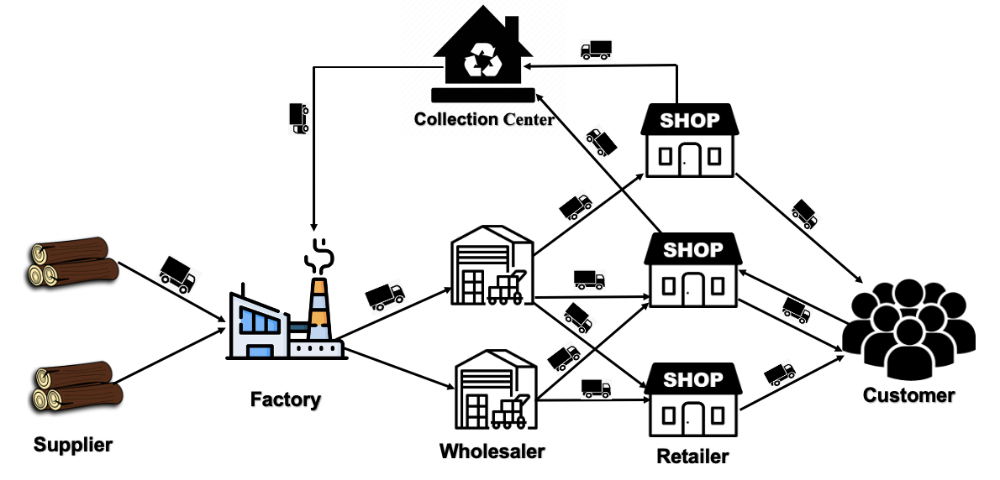

# A MULTI-PERIOD MATHEMATICAL MODEL IN WOODEN PRODUCTS SUPPLY CHAIN CONSIDERING ENVIRONMENTAL EFFECTS

A wood supply chain model solving by GAMS and GA.

## Network diagram

 

  

 

## Objectives

- To optimize five echelon close loop wooden product supply chain
- To consider environmental effect on wood supply chain
